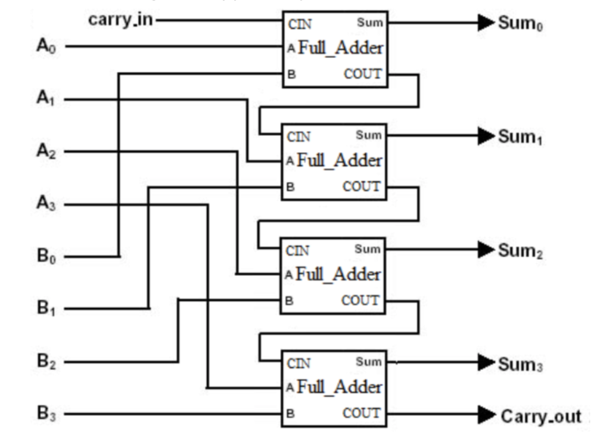

# Design Verification Using Verilog and Perl

A). Verilog code for 4‐bit ripple carry adder.

B). Perl program to automatically create the testing input data and testing output data which is used in Verilog testbench. Verilog testbench is comparing 4‐bit ripple carry adder output values with the output data created by Perl program.

4-bit Ripple Carry Adder includes 4-bit input A and B, input carry_in and 4-bit output Sum and carry_out. The design has uses 4 full adders. c_out of previous full adder is given as c_in to the next full adder. 

fulladder.v module generates sum and carry out as output. It takes a, b, and c_in as inputs. Ripple carry adder is 4-bit so I am instantiating full adder 4 times in ripple carry adder module. 

Perl program test_vectors.pl is used to create the test vectors for rcadder_fixture testbench. max_value for 4 bit input values is 2^8 = 256. A, B are 16 bit randomly generated numbers (4bit values, hence 2^4=16) and cin is 2-bit random number saved into input vector file. Sum is calculated and stored in the output file. 

The values are compared in rcadder_ficture.v, if the values match "Test Passed" is displayed else "Test Failed". This way Automatic verification is performed.  
